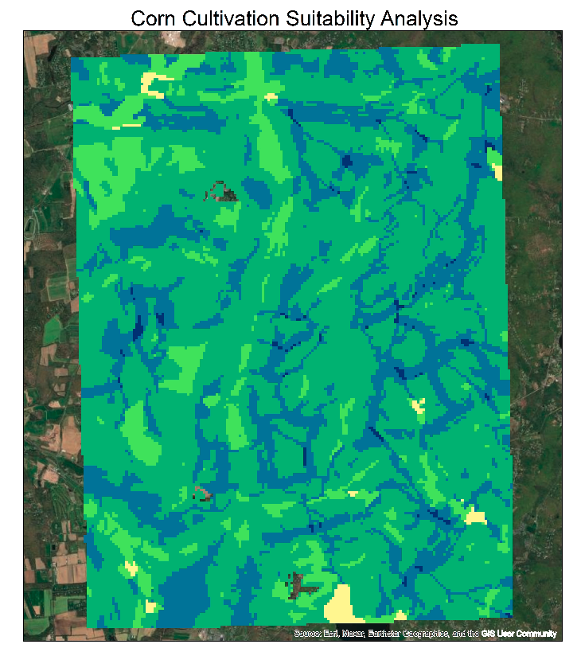

# Corn Suitability Analysis – Missouri

This GIS-based project identifies suitable areas for **corn cultivation** in a region of **Missouri** using a **site suitability analysis** in ArcGIS. The final product is a ranked raster surface that categorizes land into 5 levels of suitability: **Excellent, Good, Fair, Poor, or Unsuitable**.

<table align="center">
  <tr>
    <td>
      
    </td>
    <td>
      
    </td>
  </tr>
</table>

---

## 🔍 Objective

To locate areas best suited for cultivating corn based on four geospatial factors:

- **Land Use**: Identifies areas appropriate for agriculture  
- **Soil Drainage**: Prefers well-drained soils  
- **Slope**: Prefers flat terrain  
- **Distance to Roads**: Should be close enough for transport, but not too close (to avoid pollution)

---

## 🛠️ Tools Used

- **ArcGIS Desktop**
- **Spatial Analyst Extension**
- **Raster Calculator**
- **Euclidean Distance Tool**
- Manual classification and reclassification workflows

---

## 📊 Methodology

### 1. Convert to Raster

Shapefiles for Land Use, Soils, and Slope were converted to rasters using:

- **Field Inputs**:
  - `LandUse`: LU_CODE
  - `Soil`: DRAIN_CODE
  - `Slope`: SLOPE_CODE
- **Output Cell Size**: 50m

### 2. Reclassify Values (Scale: 1 = Unsuitable, 5 = Excellent)

Each layer was reclassified based on predefined suitability criteria:

- **Slope_Reclass**: Flat areas received higher scores  
- **Soil_Reclass**: Well-drained soils preferred  
- **LU_Reclass**: Agricultural zones ranked highest  
- **Road_Reclass**: Euclidean Distance used, reclassified with ideal mid-range distances ranked highest

### 3. Compute Road Distance

- Used **Euclidean Distance** tool with a 50m cell size  
- Classified into 11 ranges (100m intervals from 0–1000m, then 1000–1850m)  
- Reclassified using a "Goldilocks" model (middle distances = most suitable)

---

## 🧮 Suitability Equation

Final site suitability was calculated using a **weighted overlay**:

```
(LU_RECLASS * 2 + SOIL_RECLASS * 3 + SLOPE_RECLASS * 1 + ROAD_RECLASS * 2) / 8
```

- **Soil** was weighted highest (×3)  
- **Land Use** and **Road Distance** were moderately weighted (×2)  
- **Slope** was least important (×1)  

The result was a final raster surface with continuous values, which were classified into:

- **5 = Excellent**
- **4 = Good**
- **3 = Fair**
- **2 = Poor**
- **1 = Unsuitable**

---

## 📁 Files

- `corn_suitability_analysis.pdf`: Final report with methodology and maps  
- `corn_suitability.png`: Suitability output map  
- `legend.png`: Legend image used in visualization  
- `README.md`: This report

---

## 🔗 Demo

👉 [**View the full PDF report**](./corn_suitability_analysis.pdf)  
*(Opens in-browser on GitHub — no download required)*

---

## 🧠 Summary

This project demonstrates a classic **multi-criteria raster overlay** analysis and presents a simple but realistic use case in agricultural planning. It involved spatial data transformation, reclassification, Euclidean distance modeling, and raster algebra — all completed entirely within **ArcGIS Desktop**.